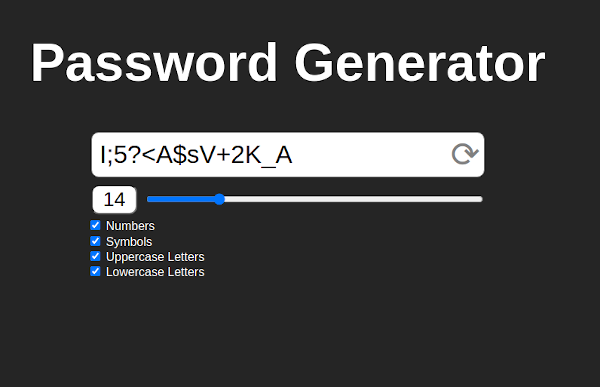

# Password Generator

A password generator written with HTML, CSS and JS!

The project makes use of `Crypto.getRandomValues()` to generate random values that are used on the password creation process.

Check it out on GithubPages: https://salv4d.github.io/password-generator/

